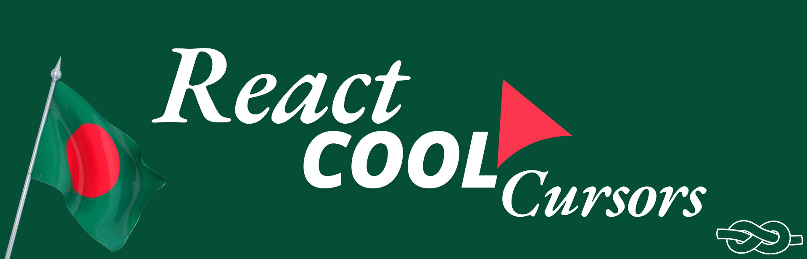

# ReactCoolCursors


A very simple npm package for react,offering smooth, react-simple-scroll-to-top feature on any website. react-simple-scroll-to-top button component that scrolls to the top of a page when pressed
The button is only visible once a certain height has been reached on the page.

<!--  -->

 

## Installation

You can install `react-simple-scroll-to-top` using npm:

```bash
npm install react-simple-scroll-to-top
```

## react-simple-scroll-to-top Styles

As `react-simple-scroll-to-top` expands, you can easily switch between different react-simple-scroll-to-top button styles. The current options are:

| react-simple-scroll-to-top Style | Import Code                                                       | Demo Button                                                                    |
| -------------------------------- | ----------------------------------------------------------------- | ------------------------------------------------------------------------------ |
| SimpleScrollToTop                | `import { SimpleScrollToTop } from "react-simple-scroll-to-top";` | [View Demo](<./src/Shared/Components/WhiteSimple/Untitled%20design%20(1).png>) |

### Basic Usage

To use the react-simple-scroll-to-top feature on any website from the library, follow these steps:

1. **Import the Component**: In your main file (e.g., `App.js` or `index.js`), add the following imports:

```javascript
import { SimpleScrollToTop } from "react-simple-scroll-to-top";
import "react-simple-scroll-to-top/dist/style.css";
```

2. **Add the react-simple-scroll-to-top Component**: Place the desired react-simple-scroll-to-top component in your render method:

```javascript
<SimpleScrollToTop />
```

### Customization

You can customize the react-simple-scroll-to-top button's appearance using the following attributes:

| Attribute                | Description                                                                                      | Default Value     |
| ------------------------ | ------------------------------------------------------------------------------------------------ | ----------------- |
| `size`                   | Set the size of the `react-simple-scroll-to-top` button.                                         | `30`              |
| `color`                  | Change the `react-simple-scroll-to-top` background color.                                        | `white`           |
| `CaretColor`             | Change the color of the caret (the up arrow) inside the button.                                  | `black`           |
| `border`                 | Set the `react-simple-scroll-to-top` button border using CSS syntax (e.g., `1px solid black`).   | `1px solid black` |
| `disableBounceAnimation` | Set the value `true` or `false` to show or hide the bounce animation when the button appears.    | `true`            |
| `bottom`                 | Set the `number value` to position the bottom part of the page where you want to see the button. | `20`              |
| `right`                  | Set the `number value` to position the right part of the page where you want to see the button.  | `20`              |

### Example Usage

```javascript
import React from "react";
import { SimpleScrollToTop } from "react-simple-scroll-to-top";
import "react-simple-scroll-to-top/dist/style.css"; // Import the necessary CSS

const App = () => {
  return (
    <div>
      {/* Custom Scroll to Top Button */}
      <SimpleScrollToTop
        size={30} // Control the size of the button
        color="red" // Control or change the background color of the button
        CaretColor="blue" // Control the caret (arrow) color
        border="2px solid green" // Set the border styling of the button
        disableBounceAnimation={false} // Set true or false to disable the bounce animation
        bottom={20} // Position the button from the bottom of the page
        right={20} // Position the button from the right side of the page
      />
      {/* Your other components */}
    </div>
  );
};

export default App;
```

### Explanation of Customization Attributes:

1. **`size={30}`**: Controls the overall size of the scroll-to-top button. The size is in pixels.
2. **`color="red"`**: Sets the background color of the button to red. You can use any valid CSS color (e.g., `#ff6347`, `green`, etc.).
3. **`CaretColor="blue"`**: Customizes the color of the caret (the up arrow) inside the button.
4. **`opacity={0.8}`**: Sets the opacity of the button. The value should be between 0 (fully transparent) and 1 (fully opaque).
5. **`border="2px solid green"`**: Applies a green border with a 2px thickness around the button.
6. **`disableBounceAnimation={false}`**: If `false`, the button will animate with a bounce effect. Set it to `true` to disable the bounce animation.
7. **`bottom={20}`**: Sets the distance from the bottom of the page where the button will appear. You can adjust the number to move the button up or down.
8. **`right={20}`**: Sets the distance from the right side of the page where the button will appear. Change this value to adjust the horizontal position.

### Final Notes

- **Customization**: You can easily adjust these props to fit your design needs. The button will automatically adapt to the size, color, opacity, and position you define.
<!-- - **Styling**: The button uses Tailwind CSS classes for its base styling. You can modify or extend the Tailwind classes for further customization. -->
- **Animation**: The `disableBounceAnimation` prop controls whether the button should animate with a bounce effect when it appears.

### Conclusion

With these simple customization options, you can integrate the `react-simple-scroll-to-top` feature into your website and make it fit your UI seamlessly.

## Contributions

If you want to contribute to this project, fork the [repository](https://github.com/arafatrahat94/react-simple-scroll-to-top) and clone it to your local machine. Commit your changes and push your changes to your forked repository. Finally, open a pull request with a detailed description of your changes to the dev branch.I highly appreciate any contributions.

## Issues

If you are facing any problem, feel free to share [here](https://github.com/arafatrahat94/react-simple-scroll-to-top/issues).

## Changelog

```markdown
### [1.0.1] - 2024-11-11

- Updated Readme

### [1.0.0] - 2024-11-10

- Initial release of `react-simple-scroll-to-top`.
- Added `SimpleScrollToTop` button style.
- Included basic usage examples in the documentation.

### [Unreleased]

- Features and improvements are being developed.
```

## Contact Me

❒ [Gmail](mailto:arafatrahat94@gmail.com) <br>
❒ [WhatsApp](https://wa.me/+8801980389400) <br>
❒ [Linkedin](https://www.linkedin.com/in/MdArafathHossain)<br>
❒ [FaceBook](https://www.facebook.com/md.arafathhossainrahat)<br>
❒ [Telegram](https://t.me/ArafathSensei94)

## Todo

- ~~Add SimpleScrollToTop button style~~
- Add Gradient style Scroll to top button.
- Add Page Progress in button outline.
- Add Wave Animation Scroll to top button.

## License

This project is licensed under the Apache 2.0 License. See the [LICENSE](LICENSE) file for more details.


---
